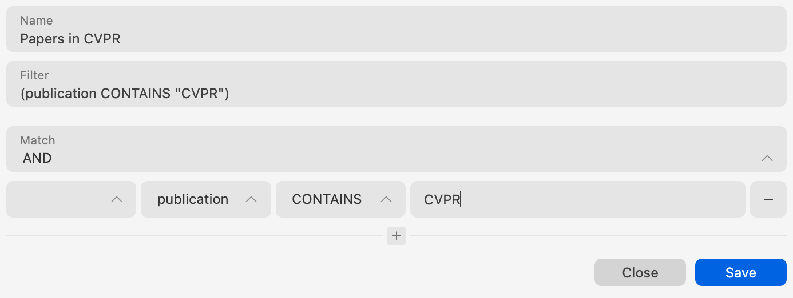
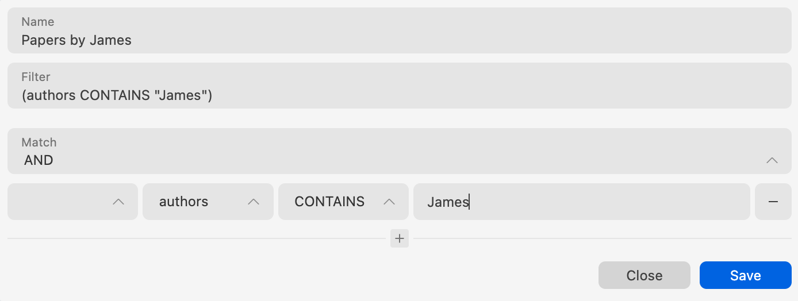
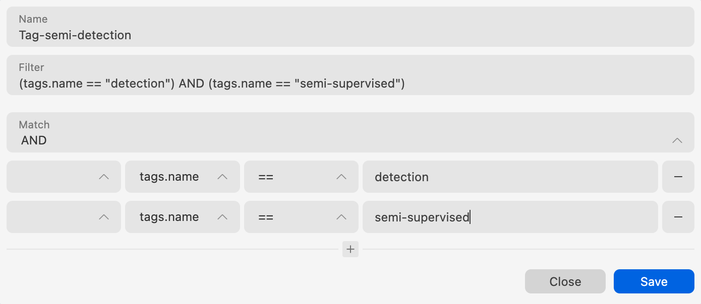
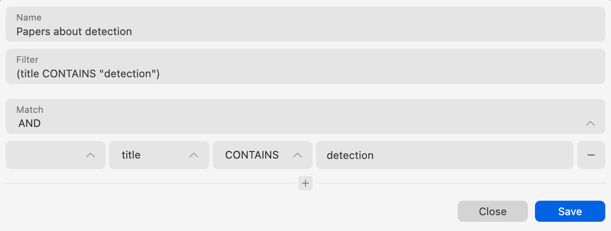

# Smart 过滤器

## 概念
智能筛选器允许您进行高级筛选。例如，您可以筛选出所有在 2020 年发表的论文，所有带有某些标签的论文，或者所有由特定作者撰写的论文等等。

## 创建智能筛选器
只需单击左侧侧边栏智能筛选器部分附近的“+”按钮，即可创建新的智能筛选器。

我们提供两种创建智能筛选器的方式：

1. 通过用户界面创建智能筛选器。
2. 通过高级搜索查询字符串创建智能筛选器。

### 通过用户界面创建智能筛选器
您可以通过单击智能筛选器创建窗口底部的“+”按钮来创建新规则。`Match` 选择框用于指定规则的组合匹配条件。对于每个规则，我们有4个字段：

- “前缀操作符”：对于集合查询和逻辑非操作很有用。
- “字段”：所有查询字段。
- “操作符”：字段的操作。
- “值”：规则的值。

### 通过高级搜索查询字符串创建智能筛选器
对于高级用户，您可以通过高级搜索查询字符串创建智能筛选器。查询语言来自我们的数据库库 [Realm Query Language](https://www.mongodb.com/docs/realm-sdks/js/latest/tutorial-query-language.html)。所有可用的查询字段都列在“字段”选择框中。

## 大小写敏感

所有字符串操作符号，例如 `CONTAINS`，都是大小写敏感的。如果你不想关心大小写，手动编辑查询字符串例如： `CONTAINS[c]` 。

## 示例

### Recently added papers

To create a dynamic date string, you can use `[x DAYS]`.

### Papers published in CVPR

### Papers published by a specific author

### Papers with multiple tags

### Keywords in papers' title
